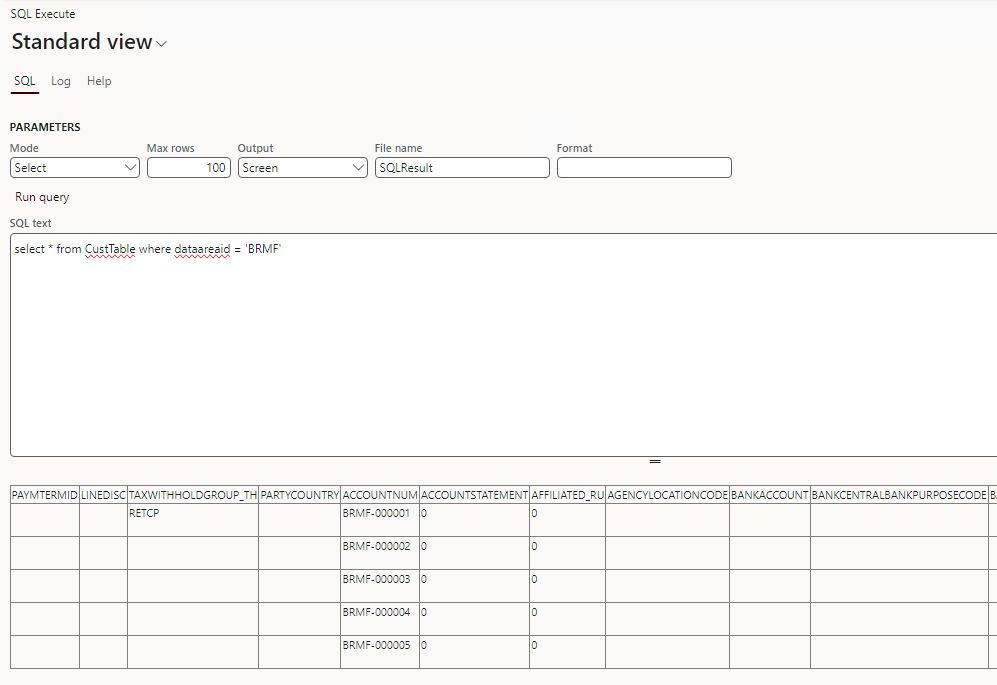

# HDG-Dynamics365-X++-Samples
Code sample collection of D365 ERP written in X++.
Written by Dong-Gyun Ha.

# Execute direct SQL from Dynamics365 ERP form

In order to overcome the limitation of not being able to create and execute a direct query in the cloud version, it is a function that allows you to create a query yourself on the form.

Refer : [XppTools Git]("https://github.com/TrudAX/XppTools/tree/master/DEVTools/DEVSQLExecute")
I have refactored the code in the above reference link. Also, I add the some functions that if update mode is selected then enabling only screen output.

